# 🚀 Deploy Prometheus and Grafana on Kubernetes using Terraform & Helm

## 📌 Project Overview

This project demonstrates how to deploy a **complete monitoring stack** using:

- Kubernetes
- Helm
- Terraform
- Prometheus
- Grafana
- AWS EC2

The monitoring stack collects metrics from Kubernetes and visualizes them using Grafana dashboards.

---

# 🏗️ Architecture
Terraform
↓
Helm
↓
Kubernetes Cluster (Minikube on EC2)
↓
Prometheus (Metrics Collection)
↓
Grafana (Visualization Dashboard)

---

# ⚙️ Technologies Used

- AWS EC2
- Docker
- Kubernetes (Minikube)
- Helm
- Terraform
- Prometheus
- Grafana

---

# 🚀 Setup Steps

## 1️⃣ Docker Installation

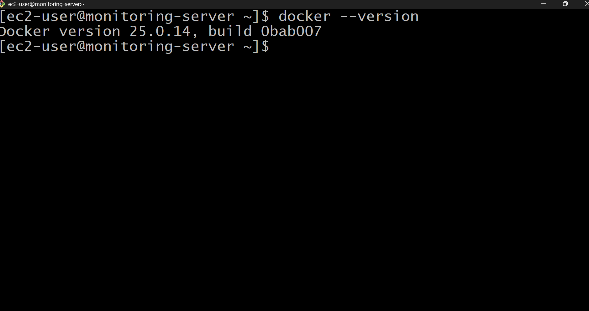

---

## 2️⃣ EC2 Instance Launch

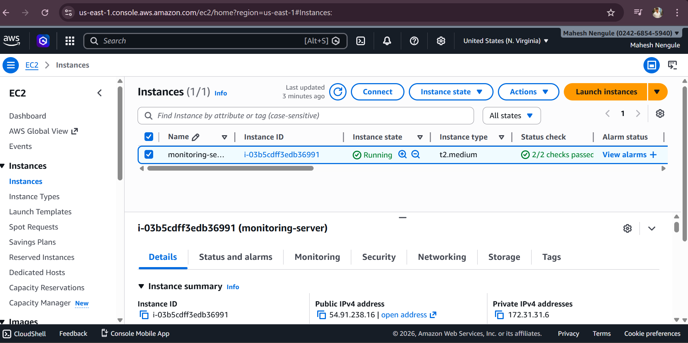

---

## 3️⃣ Kubernetes CLI Setup

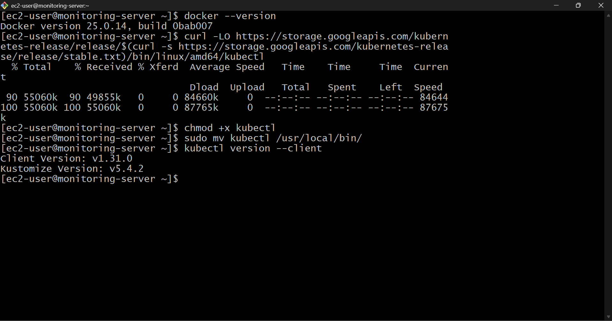

---

## 4️⃣ Helm Installation

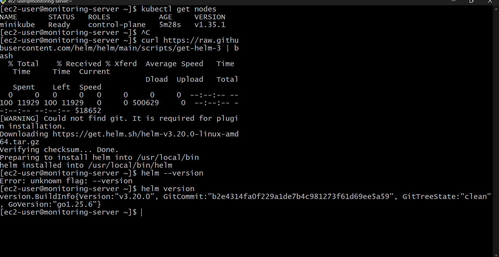

---

## 5️⃣ Helm Repositories

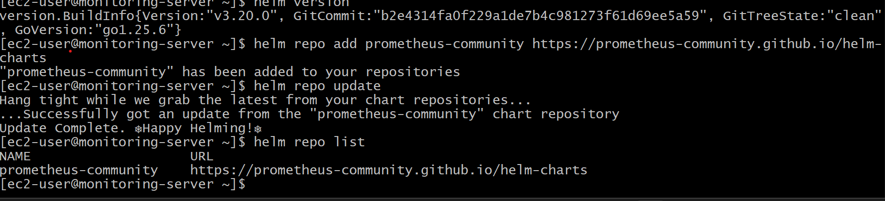

---

## 6️⃣ Kubernetes Cluster Running

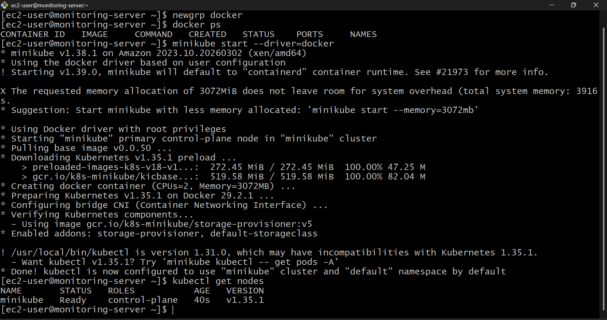

---

## 7️⃣ Monitoring Pods Running

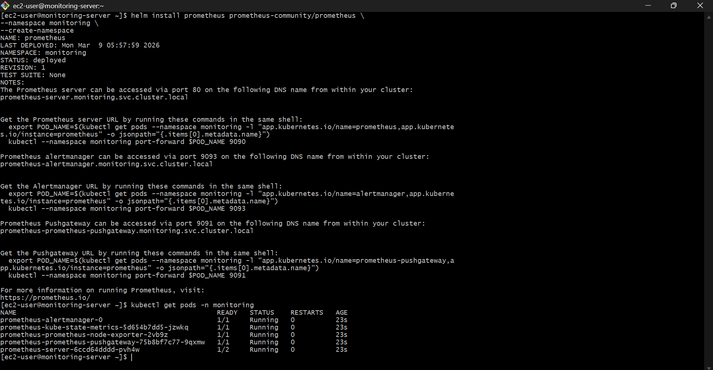

---

## 8️⃣ Grafana Pod

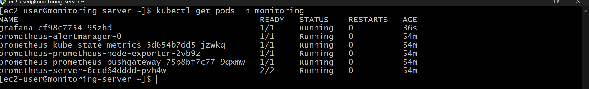

---

## 📊 Prometheus Monitoring

Prometheus collects metrics from Kubernetes cluster.

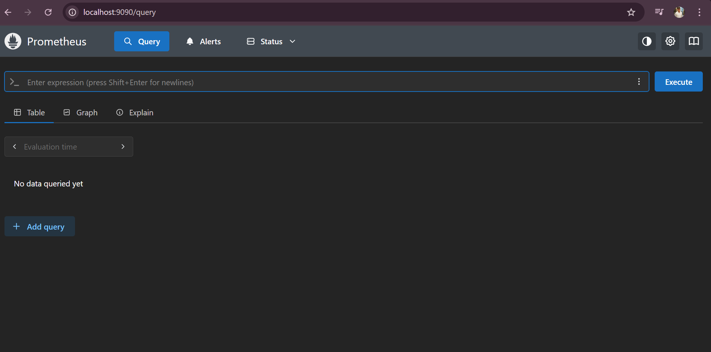

---

## 📈 Grafana Visualization

Grafana visualizes metrics collected by Prometheus.

### Grafana Login Page

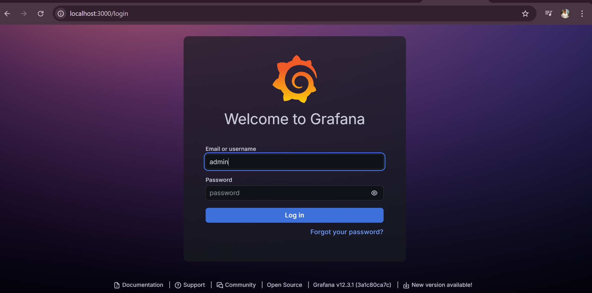

### Grafana Dashboard

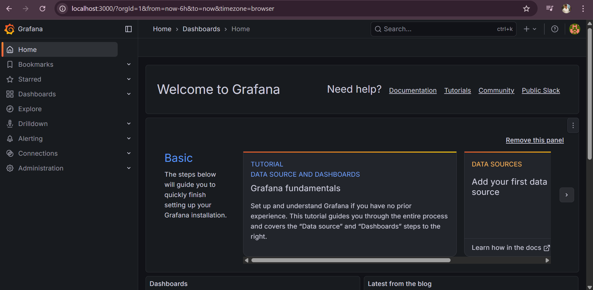

---

# 🧠 Terraform Integration

Terraform is used to manage Helm releases for Prometheus and Grafana.

### Terraform Apply

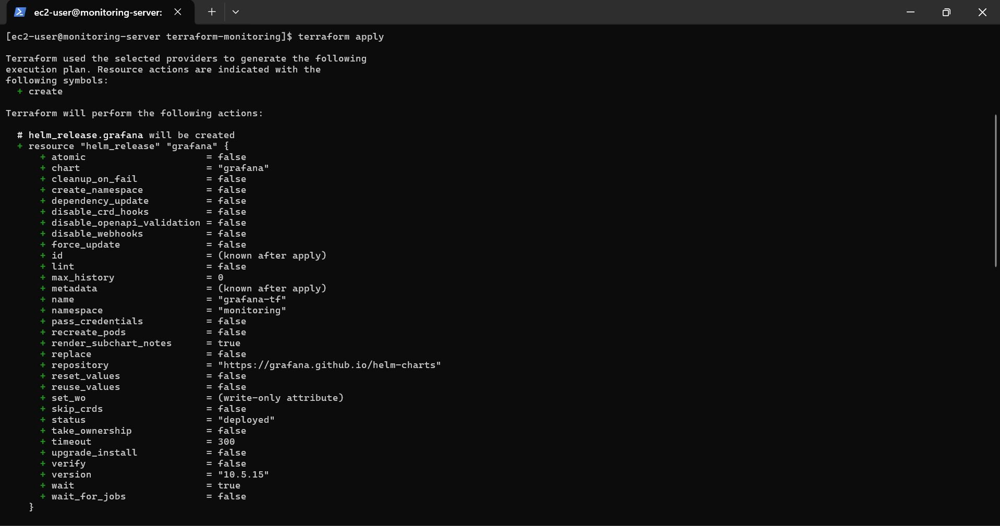

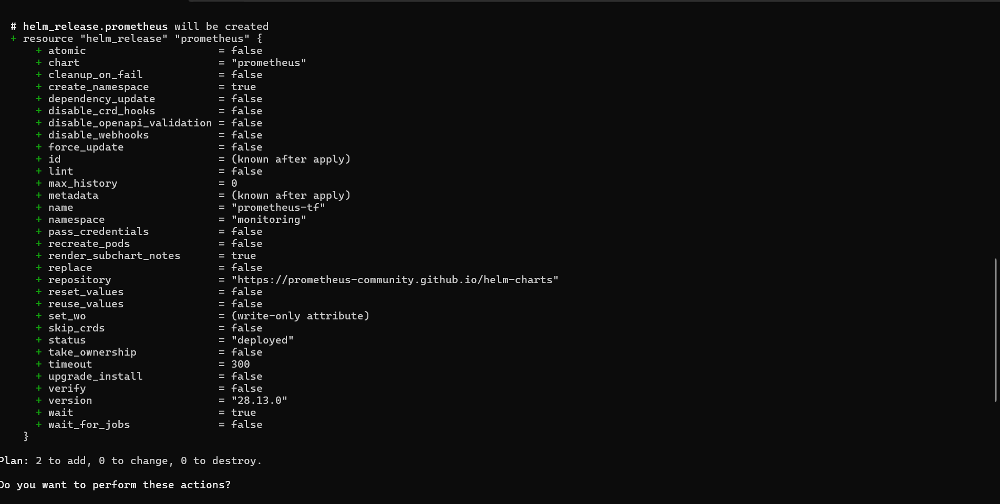

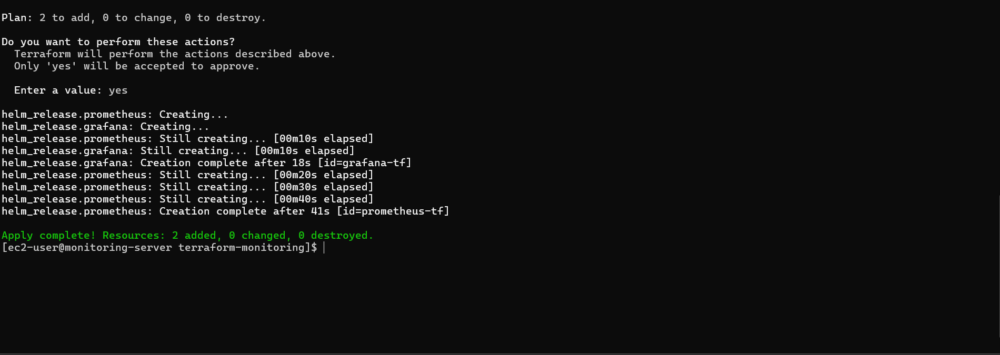

---

# 🎯 Key Features

✔ Infrastructure as Code using Terraform  
✔ Kubernetes Monitoring Setup  
✔ Prometheus Metrics Collection  
✔ Grafana Dashboard Visualization  
✔ Helm Package Management  

---

# 📚 What I Learned

- Kubernetes monitoring architecture
- Helm chart deployments
- Terraform Helm provider
- Prometheus metrics collection
- Grafana visualization dashboards

---

# 👨‍💻 Author

**Mahesh Nengule**

DevOps | Cloud | Kubernetes | Terraform | AWS